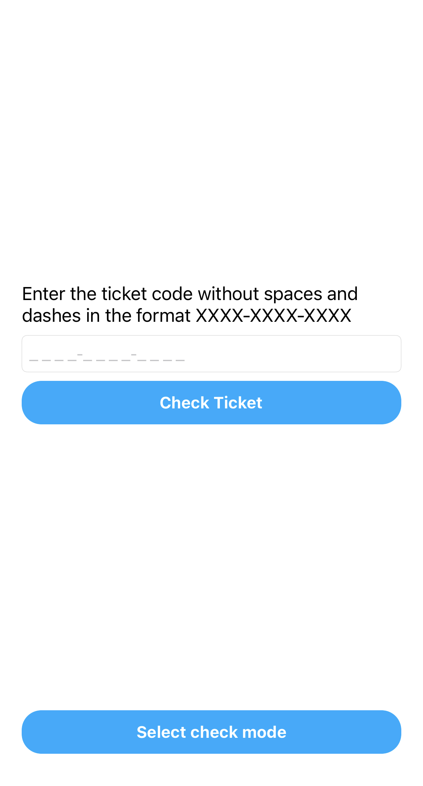

# Авторизация в приложении

После установки приложения для его успешного функционирования необходимо авторизоваться. **Авторизация доступна только для стюардов, прошедших стажировку и подписавших договор.**

Для авторизации необходимо на стартовом экране ввести номер телефона в формате `+7 XXX XXX XX XX`. На указанный номер телефона придет СМС с кодом, который необходимо ввести в приложении. 

!!! warning "Предупреждение"

    Для работы с приложением на устройствах с iOS необходим iPhone 6 или новее, так как при меньшей диагонали экрана недоступна кнопка для авторизации.

??? example "Скриншот окна авторизации"
    { width="25%"valign=left }

`:material-check: Номер занесён в базу`

:   Если номер ранее был занесен в базу данных, приложение отобразит основное меню для работы с билетами. Можно приступать к 
    [:material-book-open-page-variant: проверке билетов](tickets.md). 

`:material-cancel: Номер не найдет в базе`

:   Если номер не будет найден в базе данных, приложение отобразит ошибку. Решение проблемы описано в статье с 
    [:material-book-open-page-variant: типовыми ошибками](errors.md).

!!! success ""
    Приложение не сохраняет и не обрабатывает персональные данные.
    
    
* [Авторизация]: Процесс предоставления пользователю или группе пользователей определённых разрешений, прав доступа и привилегий в системе
