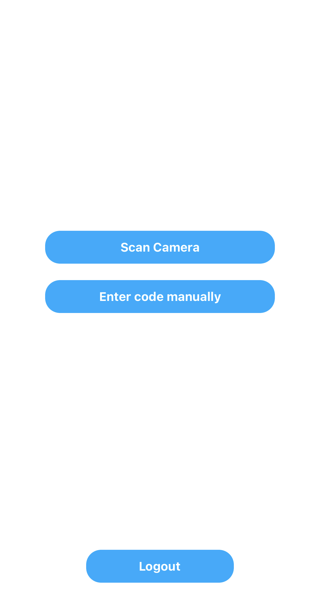

# Сканирование билетов через приложение
Подробное описание процедуры сканирования билета на матч через приложение StewardApp с возможными разветвлениями.

Функция сканирования билетов становится доступной после [успешной авторизации в приложении](login.md). На экране смартфона отобразится две возможные опции сканирования билета:

- [x] Сканировать QR-код (Scan Camera).
- [x] Ввести код вручную (Enter code manually).

Для быстрого процесса верификации билета рекомендуется использовать `сканирование QR-кода`.

??? example "Скриншот главного меню"
    { width="40%" }

## Сканирование QR-кода
При выборе режима сканирования QR-кода откроется интерфейс камеры *(предварительно необходимо дать разрешение приложению на использование камеры смартфона)*. Необходимо навести камеру смартфона на QR-код билета, расположенный в правом верхнем углу. Код должен попасть в специальную белую рамку.

??? example "Скриншот интерфейса сканирования"
    { width="40%" }

:material-check: После сканирования QR-кода появится информация о билете.

:material-cancel: Если после сканирования QR_кода не появилась информация о билете, попробуй ручной ввод кода билета.

## Ручной ввод кода

При выборе ручного ввода кода билета откроется интерфейс с полем для ввода, куда нужено ввести код билета, расположенный ниже QR-кода в правом верхнем углу. Формат кода соответствует шаблону `XXXX-XXXX-XXXX`.

??? example "Скриншот ручного ввода"
    { width="40%" }

После ввода кода необходимо нажать **Проверить билет (Check Ticket)**. Если все сделано верно, появится информация о билете. Иначе смотри <code>📌 <a href="https://callistoboy.github.io/stewards-a-book/docs/app/errors">возможные ошибки при работе с приложением</a></code>.
