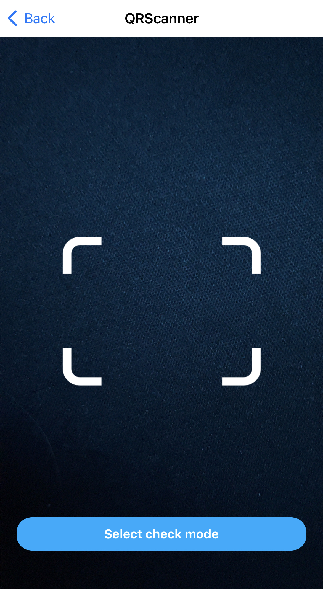

# Сканирование билетов

Инструкция описывает порядок сканирование билетов стюардом и/или волонтёром при проходе на сектор в чаше стадионе;

## Описание процедуры

Функция сканирования билетов становится доступной после [:material-book-open-page-variant: успешной авторизации в приложении](login.md). 

### Опции сканирования билетов

- [x] Сканирование QR-кода (Scan Camera).
- [x] Ручной ввод кода билета (Enter code manually).

Для быстрого процесса верификации билета рекомендуется использовать `сканирование QR-кода`.

### Сканирование QR-кода

При выборе режима сканирования QR-кода откроется интерфейс камеры *(предварительно необходимо дать разрешение приложению на использование камеры смартфона)*. Необходимо навести камеру смартфона на QR-код билета, расположенный в правом верхнем углу. Код должен попасть в специальную белую рамку.

??? info "Скриншот интерфейса сканирования"

    { width="40%" }

После сканирования QR-кода появится информация о билете.

<small>
  :octicons-light-bulb-16:
  **Подсказка:** Попробуй ручной ввод, если после сканирования QR-кода информация не загрузилась.
</small>

### Ручной ввод кода билета

При выборе ручного ввода кода билета откроется интерфейс с полем для ввода, куда нужено ввести код билета, расположенный ниже QR-кода в правом верхнем углу. Формат кода соответствует шаблону `XXXX-XXXX-XXXX`.

??? info "Скриншот ручного ввода"
    { width="40%" }

После ввода кода необходимо нажать **Проверить билет (Check Ticket)**. Если все сделано верно, появится информация о билете. Иначе смотри [:material-book-open-page-variant: возможные ошибки при работе с приложением](errors.md).

??? info "Скриншот с информацией о билете"

    { width="40%" }

### Сканирование билетов Fan ID

QR-код билета из приложения "Карта болельщика" не совместим с билетно-пропускной системой Газпром Арены, соответственно, номер билета и его код не будут считываться приложением. Для считывания таких билетов необходимо вручную ввести 12-значный код билета, который отображается в электронном билете от Fan ID.
