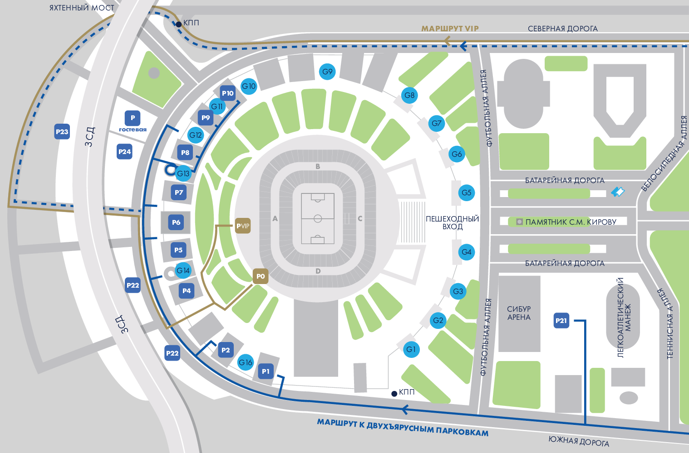

# Информация о блоке
Команда стюардов блока А обслуживает западную часть стадиона «Газпром Арена» в Санкт-Петербурге. Весь блок А и каждая его зона относится к чаше, а стюарды блока являются стюардами чаши.

## Структура блока

**Супервайзер блока А** — [:fontawesome-brands-vk: Павский Артём](https://vk.com/id9241188){:target="_blank"}

Блок включает в себя 8 этажей (2, 2+, 3, 4, 5, 6, 6+, 7), при этом ответственность среди них разграничена пятью зонами. На блоке действуют три зоны гостеприимства:

* Diamond club.
* Silver club.
* Зона гостеприимства Газпромбанк.

!!! info "Заметка"
    
    7 этаж блока A относится к команде 7 этажа блока D, поэтому наши стюарды там не работают. Также на 4 этаже вообще не работают стюарды. Это территория хостес, поскольку там находятся вип-ложи.
    
| Зона | Локация | Трибуны | Старший стюард |
| :-- | :-- | :--: | :-- |
| **`A2`** | 2 этаж 2+ этаж Silver Club зона гостеприимства Газпромбанк | D111 — A113 124 - 105| [:fontawesome-brands-vk: Щиплецова Надежда](https://vk.com/nadyaschipl){:target="_blank"} |
| **`A3`** | 3 этаж Diamond Club | A106 — A113 101 - 105 | [:fontawesome-brands-vk: Токранова Мария](https://vk.com/tokranovamari){:target="_blank"} |
| **`A4`** | 3 этаж | D111 — A106 124 - 126 | [:fontawesome-brands-vk: Рыбин Егор](https://vk.com/id87519023){:target="_blank"} |
| **`A5`** | 5 этаж | А201 — А218 234 - 205 | [:fontawesome-brands-vk: Кошевая Анастасия](https://vk.com/id25374416){:target="_blank"} |
| **`A5 Медиа`** | 5 этаж сектор СМИ | А206 — А213 201 - 202 | [:fontawesome-brands-vk: Новосёлова Ольга](https://vk.com/novo.olga){:target="_blank"} |
| **`A6`** | 6 этаж 6+ этаж | А201 — А218 234 - 205 | [:fontawesome-brands-vk: Рязанцев Денис](https://vk.com/albums68710933){:target="_blank"} |

### Как стать частью команды на блоке? { data-toc-label="" }

[:material-send: Подать заявку](https://forms.gle/E8k9f4WAYLC4x2eq5){ .md-button .md-button--primary :target="_blank"}

## Расположение медицинских пунктов

На блоке А пункт скорой медицинской помощи находится в помещении **А.3.034** на 3 этаже сектора А107 - A108, в холле стадиона.

| Этаж |           Сектор           |  Кабинет  |
| :---: |:--------------------------:|:---------:|
| 2 этаж |        В106 - B107         |  С.2.007  |
| 2 этаж |        D107 - D108         |  G.2.007  |
| 3 этаж | C103 - C104 |  D.3.003  |
| 3 этаж |        А107 - A108         |  А.3.034  |
| 4 этаж | сектор B напротив ложи №81 |  С.4.051  |
| 5 этаж |        D204 - D205         | F.5.011.1 |
| 6 этаж | B210 - B211 |  C.6.014  |

Медицинские пункты открываются за 1,5 часа до начала матча.

???+ Схема стадиона

    { max-width: "100%" }
