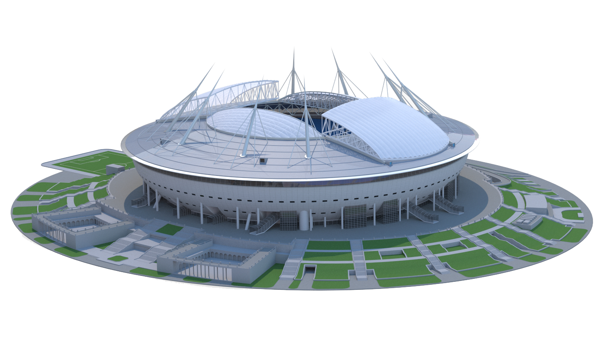

<section class="mdx-container">
    

        

            

                
            

            

                <h1>Добро пожаловать на блок А 👋</h1>
                
Здесь ты найдешь полезную информацию о работе на стадионе и блоке

                <a href="https://callistoboy.github.io/stewards-a-book/articles/basic/block/" class="md-button md-button--primary">
                    О блоке</a>
                <a href="https://forms.gle/E8k9f4WAYLC4x2eq5" target="_blank" class="md-button">
                    Хочу на блок <svg xmlns="http://www.w3.org/2000/svg" viewBox="0 0 24 24"><path
                        d="M4 11v2h12l-5.5 5.5 1.42 1.42L19.84 12l-7.92-7.92L10.5 5.5 16 11H4Z"></path></svg>
                </a>
                

                    

                        
{{ overall_ste }}

                        
активных стюардов

                    

                    

                        
{{ avg_ste }}

                        
средний выход

                    

                

            

        

    

</section>
